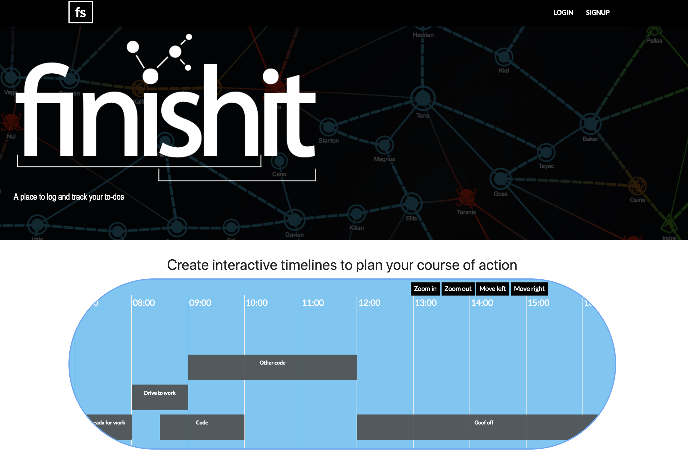
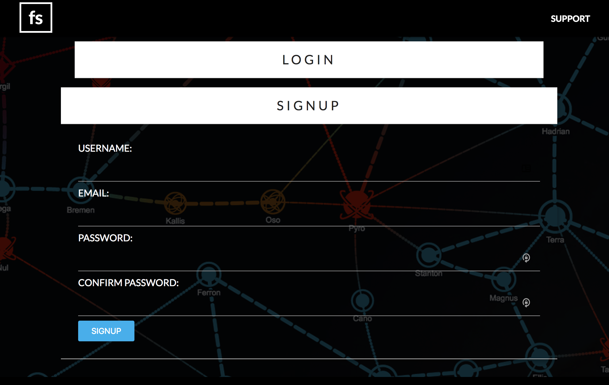
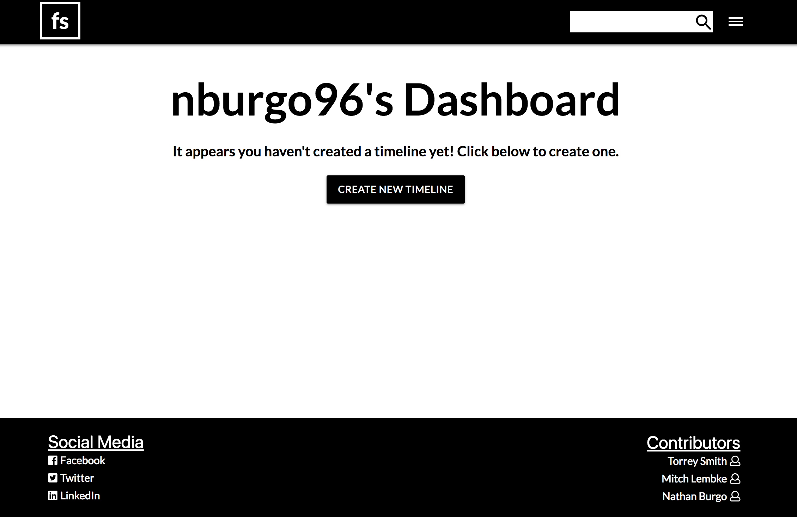
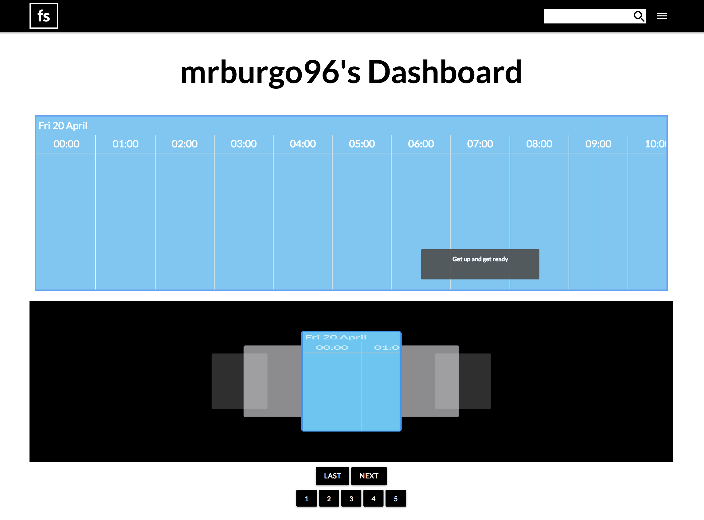
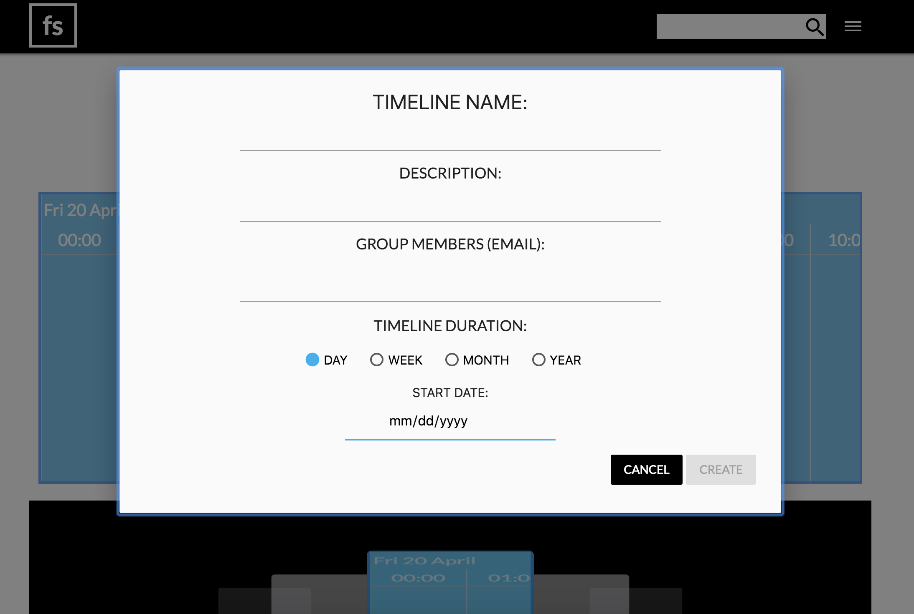
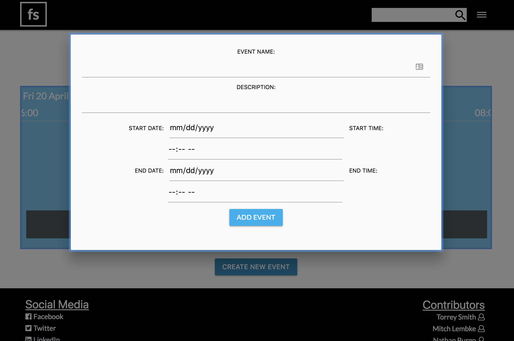

# finishit
A full-stack web application that is used to successfully manage tasks, processes, and projects.

## Table of Contents

- [Usage](#usage)
- [Support](#support)

## Usage

Open http://mtn-finishit.herokuapp.com

If you already have an account, click 'Login' in the top right corner. If you are a new users, click 'Signup'

On the login/signup page, create an account or login to an existing account.
- Your username must be at least 8 characters in length
- Your email must be a valid email
- Your password must be at least 8 characters in length and must match the 'confirm password' entry

- On your dashboard, you can view any existing timelines or create a new timeline if none exist.

- When creating a new timeline, you will have the options to name your timeline, give a description, choose the start date, and choose the scope of your timeline's events.

- After creation or selection of a timeline, you will be redirected to add events to your timeline 

## Support

Please [open an issue](https://github.com/TheRealTorreySmith/finishit/issues) for support.
